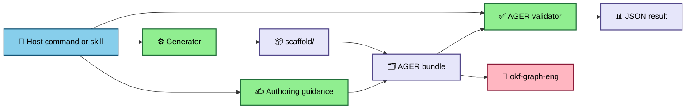
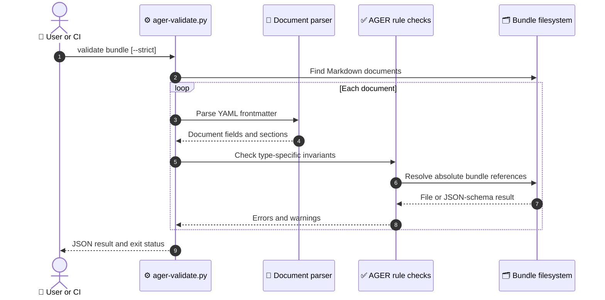

# OKF Agent Graph code walkthrough

## 1. Orientation

This repository is a plugin and document toolchain, not an agent runtime. Its
skills guide host agents, its generator creates a canonical AGER bundle, and its
validator checks the AGER-specific contract before `okf-graph-eng` performs
general graph validation.

| Path | Read it for |
|---|---|
| `.claude-plugin/`, `.codex-plugin/`, `.grok-plugin/` | Host packaging and version metadata |
| `commands/` | Thin Claude/Grok command wrappers |
| `skills/` | Init, author, validate, and compile procedures |
| `scripts/` | Deterministic generator and validator |
| `scaffold/` | Sole starter-template source |
| `sample-ager/` | Complete worked graph and schemas |
| `tests/` | Executable invariants |



## 2. Execution-order tour

### 2.1 Host entry

Each slash command is intentionally thin. For example, `/ager-init` loads the
`ager-init-graph` skill, checks that the OKF dependency is available when
needed, executes the skill, and reports paths and validation results
(`commands/ager-init.md`, lines 1–10). The other three command files follow the
same pattern.

Codex discovers the same skill directory from the `skills` field in
`.codex-plugin/plugin.json`, lines 19–36. This keeps the workflow source shared
instead of implementing host-specific behavior twice.

### 2.2 Bundle creation

The generator resolves three constants first: repository root, canonical
`scaffold/`, and the validator path (`scripts/ager-init.py`, lines 16–19).
`render_tree()` recursively replaces title and timestamp markers only in the
allowed text suffixes (`scripts/ager-init.py`, lines 22–30).

`main()` then:

1. parses destination and title (`scripts/ager-init.py`, lines 33–37);
2. rejects an existing destination (`lines 39–42`);
3. creates a UTC timestamp and a temporary sibling directory (`lines 43–46`);
4. copies and renders the scaffold (`lines 47–49`);
5. invokes strict AGER validation as a subprocess (`lines 50–54`);
6. stops with the validation JSON on failure (`lines 55–58`);
7. atomically installs with `os.replace()` and prints a JSON summary
   (`lines 59–68`); and
8. removes the temporary root in `finally` (`lines 69–70`).

### 2.3 Structural validation



`parse_document()` accepts a leading fenced frontmatter block and builds flat
values plus indented sections (`scripts/ager-validate.py`, lines 57–80).
`_section_items()` and `_section_value()` extract the two nested shapes the
rules need (`lines 87–101`). `_reference_values()` finds scalar and list paths
(`lines 104–115`), while `_validate_reference()` prevents bundle escape,
requires a file, and parses referenced JSON syntax; it does not perform JSON
Schema semantic validation (`lines 118–132`).

`validate()` discovers Markdown documents, permits only `log.md` to omit
frontmatter, validates root versions, and applies concept-specific rules
(`scripts/ager-validate.py`, lines 135–210). It counts errors and warnings and
sets `valid` according to the strict flag (`lines 212–223`). `main()` prints the
result and returns exit 0 only when `valid` is true (`lines 226–233`).

### 2.4 Full graph validation

The AGER validator does not call the OKF graph engine. The skill and CI run it
as a second layer. The integration test resolves `OKF_GRAPH` from the
environment or a sibling checkout and asserts zero warnings in strict mode
(`tests/test_ager.py`, lines 15–20 and 49–53).

### 2.5 Automation

The quality workflow checks out this repository and `okf-plugin` v0.3.2, sets
`OKF_GRAPH` for tests, runs all unit/integration tests, then invokes both strict
validators (`.github/workflows/quality.yml`). The worklog workflow independently
checks generated roadmap and commit-message invariants
(`.github/workflows/worklog.yml`).

## 3. Load-bearing invariants

1. **One template tree.** The generator reads `scaffold/`; a packaging test
   rejects duplicated skill template directories (`scripts/ager-init.py`, lines
   16–18; `tests/test_plugin.py`, lines 52–55).
2. **No overwrite.** The generator fails before staging if the destination
   exists (`scripts/ager-init.py`, lines 39–42).
3. **Install only validated output.** `os.replace()` occurs after strict
   validation and JSON parsing (`scripts/ager-init.py`, lines 50–67).
4. **Version separation.** Package manifests stay at 0.4.0 while the validator
   supports AGER 0.3.0 (`tests/test_plugin.py`, lines 12–27;
   `scripts/ager-validate.py`, line 13).
5. **Parallel outputs append.** Worker and judge documents fail validation
   unless `record_output_to.mode` is `append` (`scripts/ager-validate.py`, lines
   190–192).
6. **Unsafe tools have a boundary.** An irreversible tool requires dual
   control, compensation, or human approval (`scripts/ager-validate.py`, lines
   193–198).
7. **Secret-like scalar frontmatter values use references.** The rule checks
   non-list frontmatter lines only; it does not scan bodies, JSON/text files, or
   list mappings (`scripts/ager-validate.py`, lines 200–207).

## 4. Tests as executable specification

`test_generator_creates_complete_valid_bundle()` proves that the public init
path produces the expected title, file count, no unresolved placeholders, and
a second strict-valid bundle (`tests/test_ager.py`, lines 94–109). It catches
scaffold drift and generator/validator disagreement.

`test_missing_schema_reference_fails()` rewrites a valid sample path to a
missing schema and expects a reference error (`tests/test_ager.py`, lines
55–60). It proves references are checked against the bundle rather than merely
parsed.

`test_missing_loop_control_fails_strict()` removes the deadline control and
expects strict failure (`tests/test_ager.py`, lines 62–70). It proves warnings
become gates in strict mode.

`test_unsafe_irreversible_tool_fails()` and `test_inline_secret_fails()` mutate
the sample into unsafe forms (`tests/test_ager.py`, lines 72–84). They protect
the two security-focused validation rules.

`test_manifest_versions_stay_in_lockstep()` loads all host and marketplace
manifests and requires one package version (`tests/test_plugin.py`, lines
16–27). It catches partial release bumps.

Selected load-bearing excerpts:

```python
check = subprocess.run(
    [sys.executable, str(VALIDATOR), str(staged), "--strict"],
    capture_output=True,
    text=True,
)
if check.returncode != 0:
    print(check.stdout, file=sys.stderr)
    print("generated scaffold failed AGER validation", file=sys.stderr)
    return 1
validation = json.loads(check.stdout)
os.replace(staged, destination)
```

The initializer validates the staged bundle before `os.replace()` makes it the
destination (`scripts/ager-init.py` — `main()`, lines 45–70).

```python
errors = sum(issue["severity"] == "error" for issue in issues)
warnings = sum(issue["severity"] == "warn" for issue in issues)
return {
    # ... counts and context omitted ...
    "valid": errors == 0 and (not strict or warnings == 0),
}
```

This is the strict-mode contract: warnings fail only when `strict` is true
(`scripts/ager-validate.py` — `validate()`, lines 212–223).

```python
def test_unsafe_irreversible_tool_fails(self) -> None:
    temp, bundle = self.copy_sample()
    self.addCleanup(temp.cleanup)
    path = bundle / "tools/web-search.md"
    path.write_text(path.read_text().replace(
        "side_effects: external", "side_effects: irreversible"))
    self.assert_invalid(bundle, "irreversible Tool requires")
```

The negative test proves an irreversible tool cannot silently lose its safety
boundary (`tests/test_ager.py`, lines 72–77).

## 5. Junior engineer orientation

Five things to internalize:

1. `scaffold/` is the template; `sample-ager/` is the worked example.
2. AGER version and plugin release version are different contracts.
3. Strict AGER validation and strict OKF validation are both release gates.
4. The frontmatter parser intentionally supports a constrained subset.
5. Authoring and compile behavior live in skills; deterministic init and
   validation live in scripts.

Start debugging a failed bundle in the JSON `issues` array. For generation
failures, reproduce with `scripts/ager-init.py` and inspect the embedded
`ager_validation` result. For graph/link failures, run the external OKF command
separately.

Common changes:

- new concept or rule: `docs/AGER_SPEC.md`, `scripts/ager-validate.py`,
  `scaffold/`, `sample-ager/`, and tests;
- new starter content: `scaffold/`, then generator tests;
- host packaging: the relevant manifest plus lockstep tests;
- framework guidance: `skills/ager-compile/` and its reference table.

The riskiest files are `scripts/ager-validate.py` (contract enforcement),
`scaffold/` (all new bundles), and manifest versions (release discovery).

## 6. Gaps and design drift

- **Confirmed:** the validator uses a small hand-written frontmatter parser, so
  it is not a general YAML validator (`scripts/ager-validate.py`, lines 57–80).
- **Confirmed:** no executable framework adapters ship; the compile skill
  describes mappings and optional stubs (`skills/ager-compile/SKILL.md`).
- **Confirmed:** full OKF validation depends on external tooling and is skipped
  by its unit test when the dependency is unavailable (`tests/test_ager.py`,
  lines 49–53).
- **Confirmed drift:** the validation skill describes some checks as preferred,
  production-specific, or worker-specific (`skills/ager-validate/SKILL.md`,
  lines 19–25), while the code requires the root AGER version, warns for every
  missing recommended control, requires append mode for every worker and judge,
  and errors on unguarded irreversible tools (`scripts/ager-validate.py` —
  `validate()`, lines 152–198).
- **Recommendation:** add direct tests for malformed frontmatter boundaries and
  nested inline schema variants before expanding the parser.
- **Recommendation:** add host installation smoke tests when stable CI tooling
  exists for all three hosts.

The code and [[Design-Doc]] agree on the current boundary: this project defines,
scaffolds, and validates AGER documents; it does not execute them.
