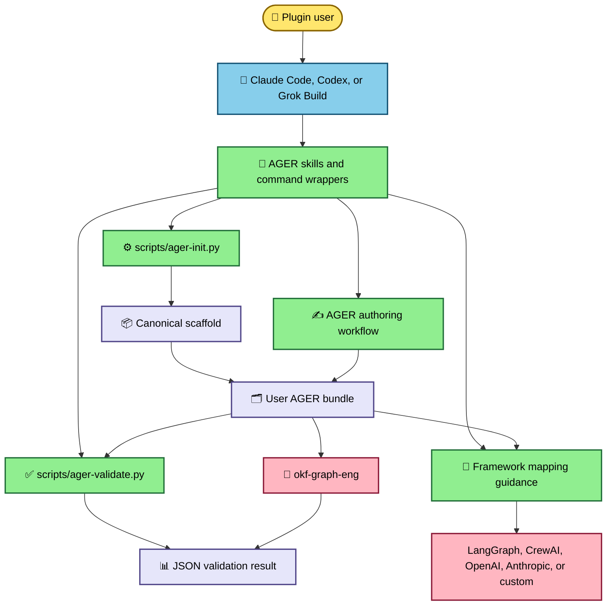

# OKF Agent Graph architecture design

## 1. Document overview

This document describes plugin release 0.4.0 and AGER schema 0.3.0 for
developers extending the plugin and project managers assessing its scope. The
repository, its sample bundle, and its tests are the sources of truth.

In scope: packaging, skills, deterministic scaffolding, structural validation,
the canonical sample, and the required OKF dependency. Out of scope: executing
agent graphs and generating production framework adapters.

Related documents: [[AGER-Specification]], [[User-Guide]], [[CLI-Reference]],
and [[Code-Walkthrough]].

## 2. Executive summary

AGER is a framework-neutral document model for multi-agent systems. Users work
through Claude Code, Codex, or Grok Build skills, or call the two Python scripts
directly. A canonical scaffold makes new bundles reproducible; a
dependency-free validator enforces AGER-specific safety and structure; the
separate `okf-graph-eng` dependency validates the broader OKF graph.

The central architectural decision is to keep configuration portable and
human-readable instead of coupling it to one runtime. The main risk is the
boundary between AGER validation and OKF validation: passing only the local
validator does not prove all links and typed edges are valid.

## 3. Requirements summary

| Requirement | Implementation | Evidence |
|---|---|---|
| Reproducible scaffolding | Copy one canonical tree, render two placeholders, validate, then atomically install | `scripts/ager-init.py` — `render_tree()` and `main()`, lines 22–70 |
| Dependency-free AGER checks | Standard-library parser and rule engine | `scripts/ager-validate.py` — `parse_document()` and `validate()`, lines 57–223 |
| Safe multi-agent contracts | Schemas, loop controls, append outputs, guarded irreversible tools, and secret references | `scripts/ager-validate.py` — `validate()`, lines 152–210 |
| Portable plugin use | Claude, Codex, and Grok manifests plus shared skills | `.claude-plugin/plugin.json`, `.codex-plugin/plugin.json`, `.grok-plugin/marketplace.json` |
| Full graph integrity | Delegate general OKF checks to `okf-graph-eng` | `tests/test_ager.py` — `test_sample_passes_strict_okf_validation()`, lines 49–53 |
| Release quality | Unit/integration tests and strict CI checks | `.github/workflows/quality.yml`, steps “Unit and integration tests” through “OKF sample is strict-valid” |

No runtime latency, availability, or scale target is defined because the
repository does not execute graphs.

## 4. System context

Purpose: show the plugin boundary. The host discovers skills; the plugin creates
or checks documents; `okf-graph-eng` is the only required external system.
Failure behavior: local AGER validation remains usable if the dependency is
missing, but full graph validation must be reported as skipped.

## 5. High-level architecture

The repository has four layers:

1. **Host packaging** — manifests and command wrappers expose the plugin.
2. **Guidance** — `skills/` defines human/agent workflows.
3. **Deterministic tooling** — `scripts/ager-init.py` and
   `scripts/ager-validate.py` perform repeatable local operations.
4. **Content** — `scaffold/` is the sole template source, while `sample-ager/`
   is a concrete, strict-valid example.

The initializer points directly to `scaffold/` and the validator and only
renders Markdown, text, and JSON files (`scripts/ager-init.py` — constants and
`render_tree()`, lines 16–30). The packaging test prevents a second template
tree from appearing under skills (`tests/test_plugin.py` —
`test_scaffold_is_the_only_template_source()`, lines 52–55).

## 6. Architectural decisions

| Decision | Rationale | Tradeoff / revisit condition |
|---|---|---|
| Markdown + YAML as the portable contract | Readable, diffable, and independent of a runtime | Adapters must translate the model; revisit only if a required framework cannot preserve the contract |
| Standard-library validation | Installation has no Python dependency bootstrap | Parser supports the repository's constrained YAML shape, not arbitrary YAML |
| One scaffold source | Prevents drift between skill templates and generated bundles | Template changes affect all hosts and require strict sample/generator tests |
| Atomic initialization | A failed generated bundle never appears as a finished destination | Requires a temporary directory on the destination filesystem |
| Split AGER and OKF validation | Keeps domain rules local while reusing the graph engine | Users must run both layers for full confidence |
| Plugin version separate from schema version | Non-breaking tooling can ship without forcing document migrations | Maintainers must keep package manifests in lockstep while changing `ager_version` only for schema breaks |

## 7. Component inventory

| Component | Responsibility | Inputs | Outputs / failure impact |
|---|---|---|---|
| Host manifests | Advertise version, capabilities, and skill paths | Repository metadata | Plugin discovery; bad paths make a host unable to load the plugin |
| `skills/` | Encode init, author, validate, and compile workflows | User request and bundle files | Repository edits or guidance |
| `scripts/ager-init.py` | Build a strict-valid bundle atomically | Destination and title | JSON result and new bundle |
| `scripts/ager-validate.py` | Enforce AGER 0.3.0 invariants | Bundle path and strict flag | JSON issues and process exit status |
| `scaffold/` | Canonical starter content | Placeholder title/time | Generated bundle |
| `sample-ager/` | Worked executable specification | Static Markdown and schemas | Validation fixture and learning resource |
| `okf-graph-eng` | Validate general OKF links and graph semantics | AGER bundle | Independent OKF validation result |

## 8. End-to-end workflows

### Create, author, and validate a bundle

```mermaid
flowchart LR
    Start([🚀 Start]) --> Destination{Destination absent?}
    Destination -->|No| Refuse[❌ Refuse overwrite]
    Destination -->|Yes| Stage[📦 Copy scaffold to temporary directory]
    Stage --> Render[⚙️ Replace title and timestamp markers]
    Render --> Strict[✅ Run strict AGER validation]
    Strict --> Valid{Valid?}
    Valid -->|No| Cleanup[🧹 Remove staged directory]
    Valid -->|Yes| Install[💾 Atomically install bundle]
    Install --> Author[✍️ Author concepts and catalogs]
    Author --> AGER[✅ Run AGER validation]
    AGER --> OKF[🔗 Run OKF graph validation]
    OKF --> Ready([🎉 Bundle ready])

    classDef start fill:#87CEEB,stroke:#145374,stroke-width:2px,color:#000
    classDef decision fill:#FFD700,stroke:#8A6500,stroke-width:2px,color:#000
    classDef process fill:#90EE90,stroke:#216E39,stroke-width:2px,color:#000
    classDef failure fill:#FFB6C1,stroke:#8B1A38,stroke-width:2px,color:#000

    class Start,Ready start
    class Destination,Valid decision
    class Stage,Render,Strict,Install,Author,AGER,OKF process
    class Refuse,Cleanup failure
```

The actual write path stages a copy, invokes the validator as a subprocess,
uses `os.replace()` only after success, and always removes the temporary root
(`scripts/ager-init.py` — `main()`, lines 39–70). The command refuses an
existing destination before any staging work (`scripts/ager-init.py` —
`main()`, lines 39–42).

## 9. Load-bearing invariants

| Invariant | Enforcement | Failure if violated |
|---|---|---|
| Bundle root uses OKF 0.2 and AGER 0.3.0 | `scripts/ager-validate.py` — `validate()`, lines 152–157 | Incompatible documents can be accepted |
| Every agent has input and output contracts | `validate()`, lines 169–172 | Runtime adapters cannot determine valid messages |
| AgentGraph binds entry, nodes, state, loop, scratchpad, and failure policy | `validate()`, lines 173–176 | The graph is structurally incomplete |
| Workers and judges append outputs | `validate()`, lines 190–192 | Parallel results can overwrite one another |
| Irreversible tools require a human, compensation, or dual control | `validate()`, lines 193–198 | An unsafe action lacks a recovery/approval boundary |
| Secret-like fields are references | `validate()`, lines 200–207 | Credentials can enter version control |
| Absolute bundle references remain inside the bundle | `_validate_reference()`, lines 118–132 | Links can escape the bundle or point nowhere |

## 10. Domain model

The AGER specification groups concepts into core graph, control, memory, and
operations/action planes. The validator's `AGER_TYPES`, `AGENT_TYPES`, path
keys, and control types are the executable subset of that catalog
(`scripts/ager-validate.py`, lines 13–38). The complete normative catalog and
typed-edge vocabulary live in [[AGER-Specification]].

## 11. Module design

### Generator

`render_tree()` walks the staged tree and replaces only `{{TITLE}}` and
`{{TIMESTAMP}}` in `.md`, `.txt`, and `.json` files. `main()` owns argument
parsing, overwrite protection, staging, validation, atomic install, JSON output,
and cleanup (`scripts/ager-init.py`, lines 22–74).

### Validator

`parse_document()` extracts the constrained frontmatter representation;
`_reference_values()` discovers bundle paths; `_validate_reference()` contains
them to the bundle and validates JSON; `validate()` applies concept rules and
summarizes issues (`scripts/ager-validate.py`, lines 57–223). `main()` is a thin
CLI that prints the JSON result and maps `valid` to the exit code
(`scripts/ager-validate.py`, lines 226–233).

### Skills and commands

Command wrappers load the corresponding skill and require reporting paths and
validation results (`commands/ager-init.md`, lines 1–10, and the parallel files
under `commands/`). Skills own judgment-heavy authoring and framework mapping;
scripts own deterministic generation and validation.

## 12. CLI API

The CLI contract is documented in [[CLI-Reference]]. Both scripts use standard
error exit behavior. The validator always prints a machine-readable JSON object
when it reaches validation; the generator prints a JSON summary after atomic
installation (`scripts/ager-init.py`, lines 59–68;
`scripts/ager-validate.py`, lines 226–233).

## 13. Security and resilience

The plugin does not store or transmit credentials. Its validator rejects
literal values in secret-like fields unless they are path or environment
references (`scripts/ager-validate.py`, lines 200–207). It also contains
root-relative references to the bundle and rejects traversal outside it
(`scripts/ager-validate.py`, lines 118–127).

Initializer cleanup is unconditional through `finally`; incomplete staging is
removed after both success and failure (`scripts/ager-init.py`, lines 47–70).

## 14. Testing and delivery

`tests/test_ager.py` covers the strict-valid sample, external OKF validation,
missing files and controls, unsafe tools, inline secrets, incompatible versions,
successful generation, and overwrite refusal (lines 31–109). Packaging tests
cover version lockstep, release advertising, Codex path resolution, skill
frontmatter, and the single scaffold source (`tests/test_plugin.py`, lines
15–55).

GitHub Actions checks out `okf-plugin` at v0.3.2, runs the full suite, then runs
both strict validators (`.github/workflows/quality.yml`).

## 15. Risks and extension roadmap

| Risk | Impact | Mitigation |
|---|---|---|
| Constrained frontmatter parser is mistaken for general YAML | Valid YAML outside its subset may be misread | Document the supported shape or adopt a YAML dependency in a future major tool release |
| AGER and OKF checks drift | A bundle passes one layer but not the other | Keep the strict integration test pinned to a known OKF release |
| Framework mappings imply runtime readiness | Users deploy incomplete stubs | Skills explicitly label compile output as guidance |
| Schema and package versions are conflated | Bundles receive unnecessary breaking changes | Keep lockstep package tests separate from `SUPPORTED_VERSION` |

Recommended next work: formalize the supported frontmatter grammar, add
adapter contract tests before shipping executable adapters, and broaden CI to
host-level installation smoke tests.

## 16. Open questions

- **Open Question:** Should a future release expose one wrapper command that
  runs both AGER and OKF validation?
- **Open Question:** Which framework adapter should be the first executable,
  tested implementation rather than guidance?
- **Recommendation:** Keep the AGER schema at 0.3.0 until a document field or
  semantic invariant changes incompatibly.

## 17. Omitted sections

- Database and cache design: this repository has no runtime database or cache.
- MCP, AI endpoint, and managed-AI integration: AGER can describe them, but the
  plugin itself calls none.
- Event-driven processing: no queue or event bus exists in the implementation.
- Deployment infrastructure and operations runbooks: the deliverable is a
  source plugin, not a hosted service.
- Authentication and authorization flows: host plugin installation is the
  boundary; this repository implements no identity service.

## 18. Summary

Top risks are validation-boundary confusion and future parser drift. No
immediate architecture decision blocks v0.4.0. Extend the validator and tests
first, then the scaffold and documentation, and only then framework mappings.
Stakeholder input is still needed before choosing an executable adapter target.
