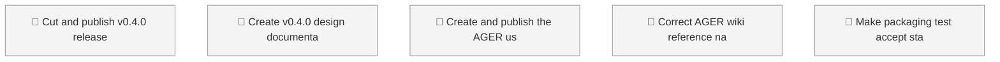

<!-- GENERATED by worklog roadmap-render. DO NOT EDIT. -->

> This file is generated from `.work/todo.jsonl`. Edits will be overwritten.
> To change the roadmap, change the work items: `worklog add|update|close`.

# Roadmap

_0 epic(s) in flight, 5 open item(s), 0 blocked, 0 unclassified._

## Now

### (no epic)

| # | Item | Type | Priority | Status | Blocked by |
|---|---|---|---|---|---|
| 01KZC5SH | Cut and publish v0.4.0 release | task | P0 | todo | — |
| 01KZC6CD | Create v0.4.0 design documentation and code walkthrough | task | P0 | todo | — |
| 01KZC6CD | Create and publish the AGER user guide | task | P0 | todo | — |
| 01KZC6EB | Correct AGER wiki reference navigation | task | P0 | todo | — |
| 01KZC6FG | Make packaging test accept stamped v0.4.0 changelog | task | P0 | todo | — |

## Next

_Nothing here._

## Later

_Nothing here._

## Milestones

### v0.4.0

| # | Item | Type | Priority | Status | Blocked by |
|---|---|---|---|---|---|
| 01KZC5SH | Cut and publish v0.4.0 release | task | P0 | todo | — |
| 01KZC6CD | Create v0.4.0 design documentation and code walkthrough | task | P0 | todo | — |
| 01KZC6CD | Create and publish the AGER user guide | task | P0 | todo | — |
| 01KZC6EB | Correct AGER wiki reference navigation | task | P0 | todo | — |
| 01KZC6FG | Make packaging test accept stamped v0.4.0 changelog | task | P0 | todo | — |

## Visual roadmap

### Dependency graph

### Hierarchy

